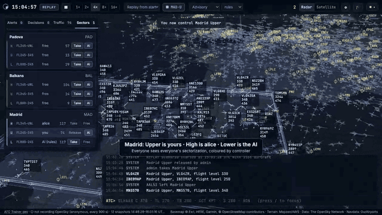

# ATC Trainer

© 2026 Gonzalo Alonso. All rights reserved. Owner, creator and developer: **Gonzalo Alonso**.
Proprietary software, not open source. See [LICENSE](LICENSE).

[](docs/media/atc-trainer-2.0-demo.mp4)

▶ **[Watch the 90-second demo video](docs/media/atc-trainer-2.0-demo.mp4)** (MP4, 1280×720). It shows:
- sign-in and the 3D scope
- vertical sectorization shared by a human controller, a second controller and the AI
- responsibility, clearances and readbacks
- AI advice on a conflict
- satellite terrain and the guided tutorial

An air traffic control trainer: a 3D working position for European airspace. It is part game, part proof of concept that a decision-making AI can control airspace. A guided tutorial takes newcomers from zero to handling a sector, decision drills train one kind of situation at a time, and an **AI coach** grades every decision, explains the alternatives, gives hints and debriefs each session. The interface is available in **English, German and Spanish**.

Real traffic recorded from the [OpenSky Network](https://openskynetwork.github.io/opensky-api/rest.html) is replayed as a living scenario. Several controllers, humans or AI agents, work it together: each takes sectors of a vertically layered sectorization and is responsible for the traffic inside them. Each aircraft follows its recorded trajectory until it is cleared otherwise, then flies the clearance with a simple performance model.

## Run

```sh
python3 -m venv .venv && .venv/bin/pip install -r requirements.txt
.venv/bin/python scripts/fetch_navdata.py      # airports + navaids (OurAirports, public domain)
VISOR_ADMIN_PASSWORD='choose-a-password' .venv/bin/python server.py   # http://localhost:8000 (API docs: /docs)
```

The server records OpenSky snapshots of Europe (34–72°N, 25°W–45°E) into `data/traffic.db` and keeps a rolling 24 h window. Leave it running to build up history.

| OpenSky access | Snapshot interval | Notes |
|---|---|---|
| anonymous | 15 min (400 credits/day, 4 per call) | coarse tracks; the replay interpolates between snapshots |
| `OPENSKY_CLIENT_ID` + `OPENSKY_CLIENT_SECRET` | 90 s | backfills the last hour on first start |

## Deploy with Docker

```sh
cp .env.example .env            # set VISOR_ADMIN_PASSWORD, optionally OpenSky / Jev credentials
docker compose up -d --build
docker compose logs -f
```

- The image contains the app and the airport and navaid data, which is downloaded at build time.
- Recordings, **user accounts and coaching sessions** (`coach.db`: graded decisions, replays, coach conversations) live in the `visor-data` volume (`/data`), so they survive rebuilds and upgrades. Keep the container running to build the 24 h history.
- **AI coach:** set `ANTHROPIC_API_KEY` for plain-language debriefs and questions (Claude, `VISOR_COACH_MODEL`, default `claude-opus-5-5`). Without it the coach still explains, grades and hints with built-in texts. See [AI coach](#ai-coach).
- **Training sessions:** at most `VISOR_MAX_SANDBOXES` private sandboxes (tutorial or exercise) run at once (default 20).
- **Idle sleep:** when nobody is online (no signed-in requests and no open scope) for `VISOR_IDLE_SLEEP_MIN` minutes (default 5, `0` = never), the simulation and tutorial sandboxes stop and free their memory. The OpenSky recorder keeps running, so the 24 h history stays complete. The next sign-in wakes the simulation with a fresh live scenario; the health probe does not wake it. `GET /api/status` reports it under `power`.
- Run **one** container. The simulation state is held in memory, so do not scale the service.
- The container listens on `127.0.0.1:8000` of the host. Publish it through a reverse proxy with TLS on its own (sub)domain; the UI uses absolute `/api` and `/ws` paths, so a sub-path such as `/visor/` won't work.

To run a published release instead of building on the server, set `VISOR_IMAGE=ghcr.io/gonzaloalonso/atc-trainer:<version>` in `.env` (for example `:2.1` to follow the 2.1.x patches), then run `docker compose pull && docker compose up -d`.

### Accounts

Every page and API call requires a sign-in. The exceptions are the login page and `GET /api/health`, which is used by the Docker healthcheck.

| Variable | Default | |
|---|---|---|
| `VISOR_ADMIN_USER` | `admin` | first admin account, created **only when there are no users yet** |
| `VISOR_ADMIN_PASSWORD` | *(empty)* | empty → a random password is printed in `docker compose logs` and must be changed at first sign-in |
| `VISOR_SESSION_HOURS` | `168` | session lifetime |
| `VISOR_COOKIE_SECURE` | `auto` | `auto` marks the cookie Secure when the proxy sends `X-Forwarded-Proto: https`; or set `true` / `false` |

After the first start the database is the source of truth: changing the variables does not modify existing accounts.

- **Managing users:** admins use **Manage users** in the account menu (`/admin`) to add, edit and remove users. Available changes are role (*admin* or *controller*), password reset (optionally forcing a change at next sign-in), and disable/enable. Disabling a user, deleting them or resetting their password signs them out everywhere.
- **Safeguards:** you can't delete, demote or disable yourself, and the last active admin can't be removed.
- **Password hashing:** PBKDF2-SHA256 with 600,000 iterations.
- **Throttling:** sign-in is throttled after 5 failures per user (20 per client address) within 5 minutes.
- **Attribution:** clearances are recorded per user; the radio log shows `ATC·alice`.

Recovery, e.g. a forgotten admin password:

```sh
docker compose exec visor python -m atc.auth list
docker compose exec visor python -m atc.auth set-password admin              # prompts
docker compose exec visor python -m atc.auth set-password ops --role admin --create
```

**AI agents** sign in with a regular account. `POST /api/auth/login` returns a `token` to send as `Authorization: Bearer <token>`. See [examples/agent_client.py](examples/agent_client.py). Agents may label their clearances `issuer: "ai:<name>"`; human clearances are always attributed to the signed-in user.

### Reverse proxy

Running behind an existing Caddy container managed by Portainer? Add `ghcr.io` under Portainer *Registries* (GitHub username + token with `read:packages`), then use [deploy/portainer-stack.yml](deploy/portainer-stack.yml) and [deploy/Caddyfile.example](deploy/Caddyfile.example) are ready-made for that. Set `VISOR_TRUST_PROXY=1` whenever the app sits behind exactly one reverse proxy, so login throttling uses the real client address.

Example nginx site (TLS via certbot or similar):

```nginx
server {
    server_name atc.example.com;
    listen 443 ssl;
    # ssl_certificate ...; ssl_certificate_key ...;

    location / {
        proxy_pass http://127.0.0.1:8000;
        proxy_http_version 1.1;
        proxy_set_header Upgrade $http_upgrade;         # WebSocket (/ws)
        proxy_set_header Connection "upgrade";
        proxy_set_header Host $host;
        proxy_set_header X-Forwarded-Proto $scheme;     # Secure session cookie
        proxy_set_header X-Forwarded-For $proxy_add_x_forwarded_for;
        proxy_read_timeout 1h;
    }
}
```

With Caddy, `atc.example.com { reverse_proxy 127.0.0.1:8000 }` is enough: it handles TLS and WebSockets and sends the forwarding headers.

Always serve it over HTTPS on a public server; otherwise passwords and session cookies travel in clear text.

## Versioning, CI and releases

`VERSION` holds `MAJOR.MINOR`. [.github/workflows/release.yml](.github/workflows/release.yml) runs on every push and pull request:

1. **Version**: the next patch number after the highest existing `vMAJOR.MINOR.*` tag. For example, with `VERSION` = `1.0` and tags up to `v1.0.4`, the next version is `1.0.5`. Pull requests get `1.0.5-dev.<sha>`.
2. **Test**: pytest (flight model, parser, conflict detection, engine plus rule agent, API), byte-compilation, a syntax check of the frontend modules, and shellcheck.
3. **Build and verify**: builds the image with the version baked in, starts it, and runs [scripts/smoke_test.sh](scripts/smoke_test.sh). The smoke test checks health, the reported version and label, UI, docs, navdata, the API contract, and that the container runs as non-root.
4. **Publish** (default branch only, after all checks pass):
   - pushes `ghcr.io/<owner>/<repo>:X.Y.Z`, `:X.Y` and `:latest` for amd64 and arm64 (here `ghcr.io/gonzaloalonso/atc-trainer`)
   - creates the annotated tag `vX.Y.Z` on the commit
   - creates a GitHub Release `vX.Y.Z` with generated notes

The running app reports its version at `/api/status`, in `/docs`, and in the UI status bar. To start a new minor or major line, edit `VERSION` (e.g. `1.1`); the patch number restarts at 0.

Local checks:

```sh
.venv/bin/pip install -r requirements-dev.txt && .venv/bin/python -m pytest -q tests
docker build --build-arg VISOR_VERSION=1.0.0-local -t visor-atc:test . && scripts/smoke_test.sh visor-atc:test 1.0.0-local
```

## Tutorial

New users are offered a guided tutorial at every sign-in until they complete it. It is optional but strongly recommended. The offer has three answers: *Start*, *Maybe later* and *Don't remind me*. The tutorial is always available from the account menu (**Tutorial**).

- **Private practice sector.** Each trainee gets their own sandbox simulation of the Alps region, working its Upper layer (ALP-U) with scripted traffic. Clearances there never touch the shared live simulation or other users. Sandboxes end when the trainee leaves, and after 30 minutes idle. At most 20 run at once.
- **A wizard with goals.** There are 14 lessons:
  1. welcome
  2. navigating the scope
  3. taking a sector
  4. reading a data block
  5. headings
  6. direct-to
  7. resume own navigation
  8. level changes
  9. spotting an STCA
  10. resolving the conflict (with a what-if prediction or a hint)
  11. the AI coach and its levels
  12. answering a pilot request
  13. time, grades and score
  14. finish

  Each lesson states its goal and how to reach it, and highlights the control involved. The goal is ticked automatically when the trainee has done it. Lessons can be skipped; the conflict lesson can be replayed if separation is lost.
- **Progress is stored per user** in `users.db`: not started, the lesson reached, completed, or declined. Trainees can resume where they left off. Admins see each user's status on the admin page and can reset it.
- **Accounts that existed before the tutorial** are marked as completed and are not prompted; they can still open it from the menu.
- **Agents can use the sandbox too:** `POST /api/tutorial/start`, then send `X-ATC-Context: tutorial` with any simulation API call, or connect to `/ws?ctx=tutorial`.
- The **Training center** (🎓 button, or the account menu) opens the tutorial, the exercises and your past sessions.

## Exercises and debriefs

Six **decision drills** each train one kind of situation in the trainee's private copy of Alps Upper (ALP-U):

| Drill | Level | Situation |
|---|---|---|
| Head-on | easy | two airliners at the same level, towards each other |
| Crossing at right angles | easy | a 90° crossing at the same level |
| Climbing through traffic | medium | a departure climbs through crossing traffic |
| Catching up | medium | a fast jet behind a slower one on the same track |
| A request you can't grant yet | medium | a level request blocked by crossing traffic, grantable later |
| The obvious level is taken | hard | a head-on pair beside traffic one level up, then a second conflict |

- **Running an exercise:** the trainee holds the sector from the start and owns the clock (pause, 1–16×). When the time is up the simulation pauses and the debrief opens.
- **Debrief:** grade and average, the score parts (safety, timing, efficiency), competencies, a timeline, and one card per situation: what was predicted, what the trainee did and when, the reference answer and why, what actually happened, and the coach's feedback.
- **Replay in 3D:** the recorded traffic of the session plays in the scope (1–16×, with a scrubber).
- **Rewind & retry:** goes back to just before a situation (snapshots every 15 simulated seconds). The attempt so far is kept with its grades, and a new attempt starts, linked to it.
- **Exercises are declarative** (`atc/exercises/`): a sector, a duration, flights placed around meeting points, and timed events such as a pilot request. New packs are plain Python data.

## AI coach

The coach follows every situation in a human controller's sectors (conflicts and pilot requests), in live traffic, the tutorial and exercises.

- **Grading:** each decision is scored out of 100: **safety** 50 (separation kept, margin), **timing** 25 (how long before the predicted loss the controller acted), **efficiency** 25 (the smallest change that works: one clearance, 1000 ft rather than a 30° turn, no action when none is needed). Hints cost 3, 7 or 15 points, and a loss of separation caps the grade at 20. Letters: A ≥ 85, B ≥ 70, C ≥ 55, D ≥ 40, E below. The reference is the rule-based AI's answer, fixed when the controller had to decide.
- **Early detection:** conflicts are followed from about 6 minutes ahead, before the 2-minute STCA, so a controller who resolves one early gets the credit for it.
- **Levels** (per user, remembered; the top-bar **Coach** select):

  | Level | Decisions list | Coach |
  |---|---|---|
  | Off | every option with its prediction | nothing reported (grades are still recorded) |
  | Evaluate | options hidden: decide yourself | a grade card after each situation |
  | Hints | options hidden, except those a hint revealed | grades; hints on request (<kbd>H</kbd>) or when a situation lingers: 1 where to look, 2 what is wrong, 3 a solution |
  | Advise | every option, with why it is or isn't the answer | grades; the AI's advice to accept |
  | Demonstrate | every option | the AI resolves your situations and explains each move (not graded) |

  New accounts start at Hints; accounts that existed before 2.1 keep the behaviour they knew (Off).
- **What-if in 3D:** hover a decision option to see the predicted tracks, the closest point of approach, a ring of the horizontal minimum and the ±1000 ft band. End a command with `?` (e.g. `TRN101 C 320 ?`), or switch the flight strip to **?** mode, to predict a clearance before sending it.
- **Language coach (optional):** with `ANTHROPIC_API_KEY` set, the debrief includes a written debrief and the trainee can ask questions about the session, in their language. It uses the official Anthropic SDK with Claude (`VISOR_COACH_MODEL`, default `claude-opus-5-5`; effort `VISOR_COACH_EFFORT`, default `medium`), a cached instructor prompt, and server-side fallback (`fallbacks: "default"`) so a declined request is retried on the recommended model. Answers are grounded on the session's record only; the coach never issues clearances. Each user may ask `VISOR_COACH_DAILY_QUESTIONS` questions a day (default 60). Without a key, or if a call fails, the built-in texts are used.
- **Privacy:** Claude receives the session's situations (callsigns, levels, predictions, actions, grades), never the user's name or email.

## Languages

The interface, the tutorial, the exercises, every coach message and the server's error messages are available in **English, German and Spanish**. The language follows the user's choice (account menu, or the login page), then the browser. Radio phraseology stays in ICAO English, as in European upper airspace, and so do pilots' replies such as "unable flight level 450".

API errors carry a stable `code` and its `params` next to the `detail` text, for example `{"detail": "Kein Luftfahrzeug NOBODY", "code": "no_aircraft", "params": {"ident": "NOBODY"}}`. The text follows the request's `Accept-Language` (the interface sends its current language), then the account's language, then English, so agents get English unless they ask otherwise. Validation errors (422) keep FastAPI's list in `detail` and add a readable `message`.

## Sectorization and responsibility

The airspace is divided into **12 regions**, and each region is split **vertically** into three layers:

| Layer | Levels |
|---|---|
| **L**ower | FL000–245 |
| **U**pper | FL245–345 |
| **H**igh | above FL345 |

That makes **36 sectors**, e.g. `ALP-U` = Alps Upper. Airspace outside the regions is unmanned. The boundaries are simplified approximations, not official data.

- **Taking sectors:** each user takes the sectors they want to control in the **Sectors** tab (or with the **My sectors** button). They can combine several. A sector held by another controller can't be taken, although admins can force a takeover or free it.
- **Handing to the AI:** any free sector, or one of your own, can be handed to the **AI**, which then controls it autonomously. A human can take it back at any time.
- **Responsibility:** every aircraft inside a sector belongs to its holder.
  - Only the holder can clear it. Others see the flight strip read-only, and the API answers 403. Aircraft in unmanned airspace can be cleared by anyone.
  - Check-ins, hand-offs, pilot requests, STCA and loss-of-separation alerts, decision points and radio messages go **only to the controllers responsible** for the sectors involved. Nobody sees issues outside their own area of responsibility; admins can query everything with `GET /api/observation?scope=all`.
  - Scores are per controller.
- **Everyone's sectorization is visible:**
  - in 3D, sectors are stacked volumes: yours are cyan, each other controller has a colour, the AI is violet, free sectors are faint outlines
  - labels show who holds which sector
  - aircraft in other controllers' sectors are tinted with their colour
- **Idle release:** a human's sectors are released after `VISOR_SECTOR_IDLE_MIN` minutes offline (default 10). Assignments are kept in memory, so take your sectors again after a server restart.
- **Admin-only simulation controls:** pause, speed and scenario (live/replay) change the simulation for everyone, so only **admins** can use them. In the tutorial sandbox the trainee has full control.

## Playing

- **Scenario:** *Live* runs just behind the newest snapshot. *Replay* starts anywhere in the recorded window and can run at 1–16× (admins).
- **Clearances:** use the flight-strip panel or the command line (<kbd>/</kbd>):

  | | |
  |---|---|
  | `DLH4AB C 370` / `D 240` / `FL 350` | climb / descend / either |
  | `TL 270` / `TR 090` / `H 180` | turn left or right to a heading / fly a heading |
  | `TL 30D` / `TR 20D` | turn by N degrees |
  | `DCT KPT` | proceed direct to a navaid or airport, then rejoin the route |
  | `S 280` | speed (IAS) |
  | `RON` | resume own navigation |

  Several clearances can go in one line: `EZY12 D 300 TR 20D S 280`. If an aircraft is selected, you can omit the callsign.
- **Aircraft behaviour:**
  - Pilots respond after 3–8 s.
  - Turn rate is limited by bank angle.
  - Climb and descent rates depend on class and altitude.
  - Impossible clearances get "unable".
  - An aircraft held at a level away from its planned profile, or kept on a heading too long, will ask for a change.
- **Monitoring:** STCA predicts 2 minutes ahead. Separation minima are 5 NM / 1000 ft, or 3 NM when both aircraft are below FL100. Traffic below 4000 ft is ignored.
- **Score:**
  - +2 per aircraft handled
  - +10 per pilot request granted
  - −2 per STCA alert
  - −10 per ignored request
  - −50 per loss of separation, but only if you were warned (at least 45 s of STCA) or you controlled one of the aircraft

Display settings (⚙) cover vertical exaggeration, speed vectors, trails, drop lines and labels. The map style can be Radar (dark) or Satellite.

## AI integration

The simulator is the environment, and humans and agents use the same API.

**Decision points.** When a situation needs a decision (a conflict or a pilot request), the engine publishes a decision point shaped for decision models such as Jev, which take state plus typed questions and return typed answers:

```json
{
  "id": "D12", "kind": "conflict",
  "state": { "conflict": {...}, "aircraft": [...], "neighbours": [...], "separation_minima": {...} },
  "questions": [
    { "id": "action", "type": "choice", "prompt": "...",
      "options": [ { "id": "o3", "label": "DLH4AB climb FL360",
                     "clearances": [ { "aircraft": "DLH4AB", "kind": "CLIMB", "value": 360 } ],
                     "predicted": { "los_duration_s": 0, "min_h_nm": 6.1, "first_los_s": null, ... },
                     "cost": 1.0 } ] },
    { "id": "urgency", "type": "score", "scale": ["low", "medium", "high", "critical"] },
    { "id": "will_lose_separation", "type": "probability", "statement": "..." }
  ]
}
```

Every option is scored by fast-time prediction: the aircraft and their neighbours are cloned and flown 4 minutes ahead with that clearance applied. The agent chooses from explicit consequences. Answering `{"action": "o3"}` executes the option.

**AI assistance** follows your coach level (see [AI coach](#ai-coach)), for decision points in *your* sectors:
- **Advise:** the agent's choice is highlighted and you click *Accept*.
- **Demonstrate:** the agent's choice is executed directly, and the coach explains it.

The AI select next to the coach level picks the agent. Sectors handed to the AI are always controlled autonomously by that agent. `POST /api/ai` still accepts the modes `off`, `advisory` and `autonomous` (the levels Off, Advise and Demonstrate).

Every option also carries its `role` (`monitor`, `vertical`, `lateral`, `approve`, `deny`, ...) and a `why` message, and the decision point names the reference answer in `best`.

The built-in agents are `rules` (the reference baseline) and `jev`.

**Jev.** Set `JEV_ENDPOINT` (plus `JEV_API_KEY` and `JEV_MODEL` if needed) and select the `jev` agent. The request and response mapping lives in two functions in [atc/agents/jev.py](atc/agents/jev.py): `build_request` and `parse_response`. Adapt them to the provider's actual wire format.

**External agents** can use the HTTP API directly. See [examples/agent_client.py](examples/agent_client.py).

| Endpoint | Purpose |
|---|---|
| `GET /api/sectors` | sectorization catalogue with the current holders |
| `POST /api/sectors/{id}/take` · `/release` · `/assign-ai` | take, release or hand a sector to the AI |
| `GET /api/observation` | all traffic (with sector and holder) plus *your* conflicts, open decisions and score (`scope=all` for admins) |
| `GET /api/decisions`, `POST /api/decisions/{id}` | list and answer your decision points |
| `POST /api/clearance`, `POST /api/command` | structured or shorthand clearances for traffic in your sectors (`issuer: "ai:<name>"`) |
| `POST /api/sim` | pause/resume/speed/reset; `lockstep` + `step` so the agent owns the clock (admins) |
| `GET /api/events?since=` | radio and alert log |
| `POST /api/probe` | predict a clearance without issuing it (3D tracks, closest approach, no-action baseline) |
| `GET /api/decisions/{id}/whatif?option=` | 3D prediction of one option |
| `GET /api/coach`, `POST /api/coach` | your coach level, and the language coach's status |
| `POST /api/coach/hint` | the next hint for one of your situations (costs points) |
| `GET /api/exercises`, `POST /api/exercises/{id}/start` | the drills, with your best result; start one (`X-ATC-Context: exercise`) |
| `POST /api/exercise/rewind`, `/stop` | rewind to a time or to before a situation; leave |
| `GET /api/sessions`, `GET /api/sessions/{id}` | your coached sessions and their graded situations |
| `GET /api/sessions/{id}/replay` | recorded traffic for the 3D replay |
| `POST /api/sessions/{id}/debrief`, `/ask` | the coach's debrief and answers, in `lang` (en, de, es) |
| `POST /api/auth/prefs` | your language and coach level |
| `GET /api/schema` | action space description |
| `WS /ws` | 2 Hz state frames (used by the UI) |

In the UI, decision options follow the user's coach level. Agents that sign in with a bearer token always get every option, whatever the account's coach level.

## Changes in 2.1

- **Coach levels replace the AI modes.** The AI mode select became the **Coach** select; `POST /api/ai` modes map to the levels `off`, `advise` and `demonstrate` and are remembered.
- **Options can be hidden.** At the Evaluate and Hints levels, a user's frames, `/api/decisions` and `/api/observation` show only the options a hint revealed, and answering a hidden option returns 403. Requests with a bearer token (agents) are not affected.
- **Frames** gain `coach` (level, open hints, latest grades) and, in exercises, `exercise`. Decision options gain `role` and `why`, and decision points `best` (hidden together with the options). Events can carry a `msg` (`{key, p}`) and a `grade`.
- **Errors in the user's language:** error responses add `code` and `params` to `detail`, and `detail` follows `Accept-Language` or the account's language (English by default). Clients that matched error texts should match `code`; the English texts are unchanged.
- **New data file:** `coach.db` in the data directory.

## Breaking changes in 2.0

- **Sector selection:** `POST /api/sector` is gone. Use `POST /api/sectors/{id}/take` and `/release`. Sector ids changed (e.g. `ALPS-UPPER` became `ALP-U`), and `GET /api/sectors` returns a catalogue object: `layers`, `regions`, `sectors` with holders, and `me`.
- **Authority:** clearances and decision answers are refused with **403** for aircraft in a sector held by someone else.
- **Admin-only simulation:** `POST /api/sim` on the shared simulation requires an admin account. Tutorial sandboxes are unaffected.
- **Per-user AI:** `POST /api/ai` sets your own AI preference; there is no global AI mode any more.
- **Filtered views:** observation, events, decisions and WebSocket frames are filtered to your area of responsibility. The frame layout changed:
  - aircraft rows gain `sector` and `controller` columns
  - per-viewer flags are no longer in the rows
  - new keys: `me`, `sectorization`, `points`
  - `score` is yours
  - `sector` was removed

## Code map

- `atc/recorder.py`, `atc/store.py`, `atc/opensky.py`: polling, SQLite rolling history, OAuth2 client
- `atc/scenario.py`: streams recorded snapshots into flight plans
- `atc/aircraft.py`, `atc/performance.py`: flight model, autopilot modes, pilot delay, performance classes
- `atc/clearances.py`: clearance model, shorthand parser, readback phrasing
- `atc/conflicts.py`: STCA and loss-of-separation detection
- `atc/sectors.py`: sectorization (regions × vertical layers), `sector_at()`
- `atc/control.py`: sector holders, take/release/AI, idle release
- `atc/decisions.py`: decision points and fast-time prediction
- `atc/training.py`: tutorial sandboxes (scripted scenario, per-user engines, idle reaping)
- `atc/exercises/`: declarative exercises, the decision drills, and the exercise runner (timeline, snapshots, rewind)
- `atc/coach/`: the AI coach: explanations (`explain.py`), grading, the decision journal and hints (`journal.py`), sessions (`store.py`), the language coach (`llm.py`) and its messages (`text.py`)
- `atc/engine.py`: simulation loop, traffic life-cycle, requests, scoring, events
- `atc/api.py`: FastAPI REST and WebSocket
- `public/js/`: three.js client
  - `tiles.js`: level-of-detail terrain from AWS Terrain Tiles plus Esri imagery
  - `traffic.js`: instanced aircraft, drop lines, vectors, trails
  - `overlay.js`: ATC symbology, data blocks and sector labels
  - `sectors3d.js`, `holders.js`: stacked 3D sector volumes coloured by holder
  - `ui.js`: panels, strip, radio, command line
  - `tutorial.js`: the guided tutorial wizard (lessons, goal detection, highlights)
  - `coach.js`, `debrief.js`, `whatif.js`: coach cards and hints, training center and exercises, debrief and 3D replay, what-if predictions
  - `i18n.js` and `public/locales/{en,de,es}.json`: translations

## About, build information and copyright

The account menu has an **About ATC Trainer** item; clicking the version in the status bar opens it too. It shows:

- **Build:** version, release or development build, git commit (linked to the source), and build date.
- **Runtime:** Python, platform, server libraries, the client's three.js revision, and server start time.
- **Ownership:** the copyright notice and the credits for data and third-party software.

The same information is available as JSON at `GET /api/about` (signed in).

- **Release images:** the workflow bakes in the version, commit, build date and repository URL. They also appear as OCI labels: `org.opencontainers.image.{version,revision,created,source,authors,vendor}`.
- **Local runs:** the version reads `dev`, and the commit is taken from git; uncommitted changes are flagged.

ATC Trainer is © 2026 Gonzalo Alonso, who is its owner, creator and developer. All rights reserved. It is proprietary software, not open source: no use, copying, modification or distribution without written permission (see [LICENSE](LICENSE)). The third-party data and libraries listed in the About dialog remain under their own licences and terms.

The container images are published to a **private** GHCR package. Servers pull them with registry credentials: a GitHub token with `read:packages`, set in Portainer under *Registries*, or `docker login ghcr.io`.

## Limitations

- No wind model (ground speed equals true airspeed), no wake-turbulence spacing, and no approach or departure procedures. Aircraft appear when first seen airborne and disappear on landing or when leaving the area.
- Sector boundaries are simplified approximations, not official airspace data.
- With anonymous OpenSky access, recorded tracks are 15 minutes apart, so routes between snapshots are straight lines.
